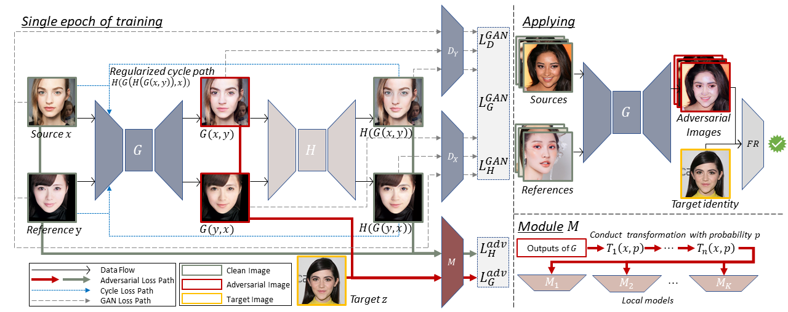

# AMT-GAN

The official implementation of our CVPR 2022 paper "**Protecting Facial Privacy: Generating Adversarial Identity Masks via Style-robust Makeup Transfer**".[[Paper](https://arxiv.org/abs/2203.03121)] 


## Abstract
Cases of misidentification leading to wrongful arrests due to facial recognition systems have occurred in various countries, including Indonesia and the United States. Adversarial makeup emerges as a potential solution to expose vulnerabilities in these systems while preserving a natural appearance. This study aims to evaluate the effectiveness of two generative models, AMT-GAN and Adv-Makeup, in producing adversarial makeup for black-box attacks against face recognition systems. A quantitative experimental method was employed using a dataset comprising 2,898 non-makeup images and 3,917 makeup images sourced from LFW, CelebA-HQ, EMFD, LADN, and additional images from Instagram and Pinterest. Preprocessing steps included face cropping, resizing, normalization, detection of 468 facial landmark points, and facial region segmentation using a BiSeNet-based model. AMT-GAN, which applies spectral normalization to generate full-face adversarial makeup, was compared to Adv-Makeup, which focuses on modifying the eye area. To optimize performance, the model architecture was fine-tuned and the learning rate was adjusted to improve training stability and convergence. Digital testing showed that AMT-GAN achieved an Attack Success Rate (ASR) of 63.32–80.28%, while Adv-Makeup outperformed it with ASR ranging from 71.00–98.18%. In physical attack scenarios, AMT-GAN recorded ASRs between 20.70–83.33%, while Adv-Makeup achieved 30.71–88.88%. AMT-GAN demonstrated greater robustness to variations in camera angles and facial poses. On the Face++ platform, adversarial makeup generated by AMT-GAN received an average confidence score of 62.71%, compared to 60.90% for Adv-Makeup. Both models effectively generated adversarial makeup capable of evading facial recognition systems, with Adv-Makeup achieving higher attack success rates, while AMT-GAN showed greater resilience under diverse physical conditions. This study highlights that optimizing the model architecture and leveraging precise landmark points and segmentation can significantly enhance the transferability and effectiveness of adversarial makeup in both digital and physical environments.



## Latest Update
**2025/5/10**   We have renewed the demo test dataset (100 pics to 1000) for a broader evaluation.\
**2025/1/01**   We have released the official implementation code.

## Setup
- **Get code**
```shell 
git clone https://github.com/salmaff/AMT-GAN-Advance.git
```

- **Build environment**
```shell
cd AMT-GAN-Advance
# use anaconda to build environment 
conda create -n AMT-GAN python=3.8
conda activate AMT-GAN
# install packages
pip install -r requirements.txt
```

  
- **The final project should be like this:**
    ```shell
    AMT-GAN
    └- assets
       └- datasets
       └- models
    └- backbone
    └- checkpoints
       └- G.pth
       └- ...
    └- ...
    ```

## Quick Start
- **Train AMT-GAN**
```shell 
python train.py  # results saved in /log
```
- **Simple evaluation on local models and Face++**
```shell 
python test.py  # generated images saved in /assets/datasets/save
python test_faceplusplus.py #Evaluate confidance score with face++
```

## Customize
- **Target identity**
  - Put target face image in ```/assets/datasets/target```
  - Modify ```TARGET_PATH``` in ```train.train_net```
  
- **Local(training) models**
  - Modify ```MODELS``` in ```configs.yaml```, such as ```['facenet', 'ir152', 'irse50'] → ['facenet', 'ir152', 'mobile_face']```
  - To load your own pretrained models, modify ```backbone.solver.build_model``` and ```configs.yaml``` accordingly.

- **Local(testing) models**
  - Modify ```args.model_names``` in ```test.attack_local_models```

- **Test image**
  - Put test face image in ```/assets/datasets/test```, assert that the test image is from the same identy of target face image.
  - Modify ```args.target_path``` in ```test.attack_local_models, test.attack_faceplusplus``` accordingly.

- **Reference images**
  - Put reference images (for makeup transfer) in ```/assets/datasets/reference```

*Please note that if you want to train a new AMT-GAN, G.pth, H.pth, D_A.pth and D_B.pth in /checkpoints should be deleted or renamed.*


```
